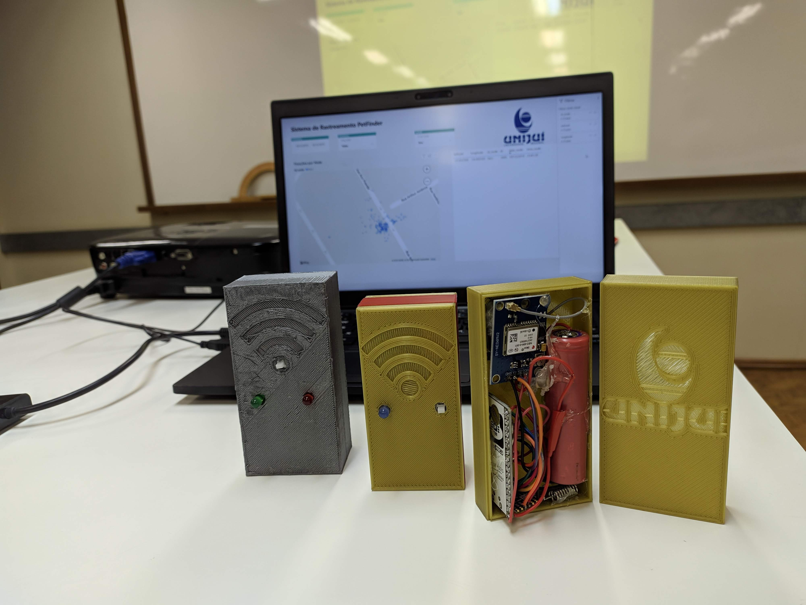
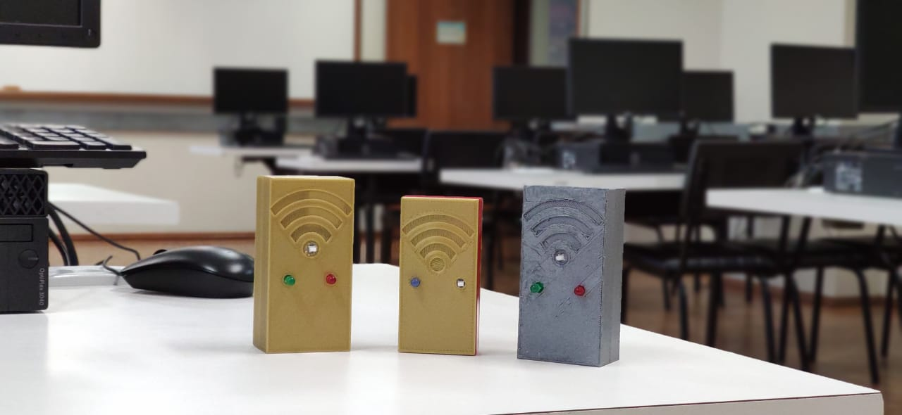

# RASTREAMENTO UTILIZANDO COMUNICAÇÃO LORA
> Este projeto foi desenvolvido na matéria de Sistemas Embarcados e Tempo Real do curso de Ciência da Computação da UNIJUÍ.

O projeto consiste em um Gateway que recebe coordenadas de seus End-Nodes. O Gateway envia as informações para o Network Server. O network Server envia as informações para a camada de aplicação.

## Materiais
Para o Gateway os seguintes itens foram utilizados:
- ESP 32;
- Módulo LoRa 915Mhz SX1276 RF Wireless
- 1 LED
- Switch on/off
- bateria 18650
- Case

Para os End-Nodes os seguintes itens foram utilizados:
- ESP 32;
- Módulo LoRa 915Mhz SX1276 RF Wireless
- Módulo GPS NEO-6M
- 2 LEDs
- Switch on/off
- bateria 18650
- Case

O projeto do Case, que foi impresso em uma impressora 3D, pode ser acessado na pasta Modelo3DCase

## Imagens

## Bora contribuir?

1. Faça o _fork_ do projeto (<https://github.com/yourname/yourproject/fork>)
2. Crie uma _branch_ para sua modificação (`git checkout -b feature/fooBar`)
3. Faça o _commit_ (`git commit -am 'Add some fooBar'`)
4. _Push_ (`git push origin feature/fooBar`)
5. Crie um novo _Pull Request_

